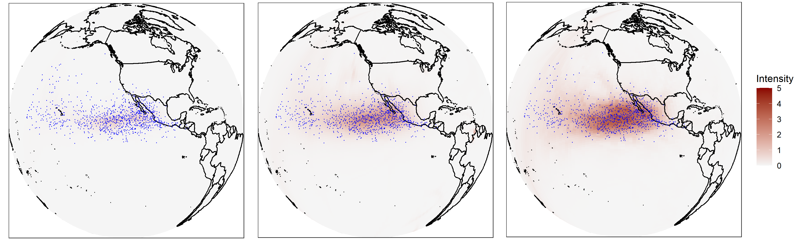

# Non-Homogeneous Poisson Process Intensity Modeling and Estimation using Measure Transport

This GitHub page provides code for reproducing the results in Section 4.2 of the manuscript titled *Non-Homogeneous Poisson Process Intensity Modeling and Estimation using Measure Transport* by Tin Lok James Ng and Andrew Zammit-Mangion. The manuscript describes the use of normalizing flows, specifically radial flows, to model the intensity function of a non-homogeneous point process on the sphere.

The figure below depicts results from modeling the end locations of cyclone data in the North Pacific Ocean using the normalizing flows. The center panel shows the intensity-function estimate, while the left and right panels depict the empirical 10 and 90 percentiles of the bootstrap distribution of the intensity function, respectively.

  

    
  

## Instructions

Please note the following if proceeding to reproduce the results in Section 4.2.

**Software requirements:** R (>=3.6), Python (>=3.7), PyTorch, Numpy

**Hardware requirements:** >= 16GB of RAM. Multiple cores could be used with slight code modification to parallelize the fitting and bootstrapping procedures.

**Contents:** 
- `pacific.csv`              Data containing the end locations of cyclones ni the North Pacific Ocean
- `sphere_pp_vec.py`         Fits the model to the cyclone locations data
- `sphere_est_avg.py`        Obtains the ensemble average from the model fits
- `sphere_np_boot.py`        Obtain nonparametric bootstrap estimates
- `sphere_np_percentile.py`  Obtain the 10th and 90th percentiles from nonparametric bootstrap estimates
- `plot_est_intensity.R`     Plots the estimated intensity function
- `plot_np_lower.R`          Plots the empirical  10  percentile  of the  bootstrap  distribution
- `plot_np_upper.R`          Plots the empirical  90  percentile  of the  bootstrap  distribution
- `run_all.sh`		       A bash script that runs all of the above

**Notes:**	Please run the bash script `run_all.sh` or the scripts below in the following order:
- `sphere_pp_vec.py` 
- `sphere_est_avg.py` 
- `sphere_np_boot.py`
- `sphere_np_percentile.py`
- `plot_est_intensity.R`
- `plot_np_lower.R`
- `plot_np_upper.R`
